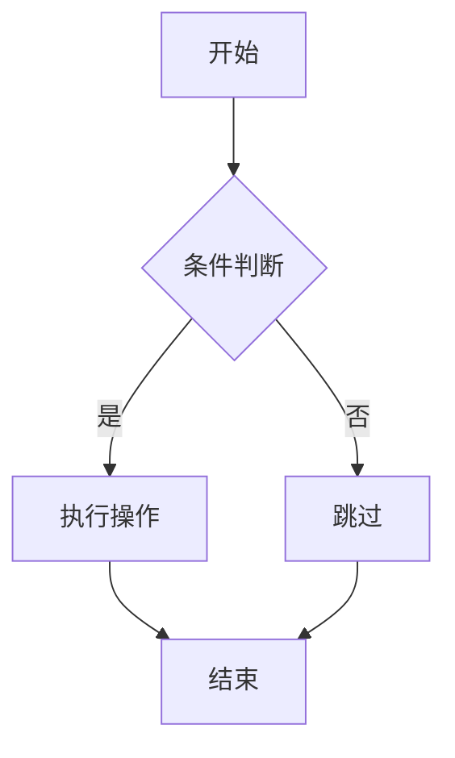
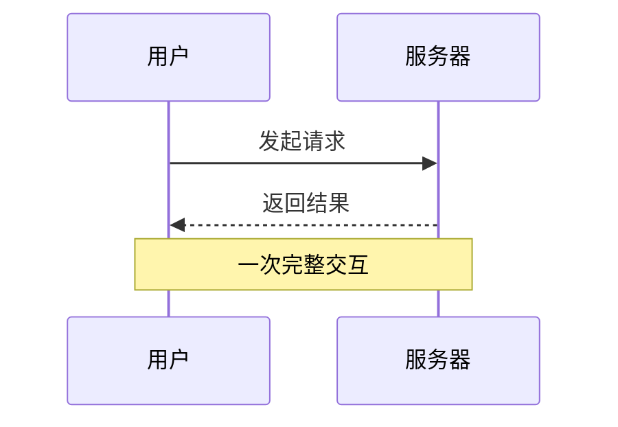
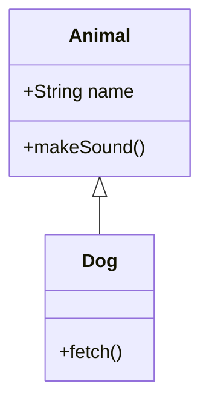
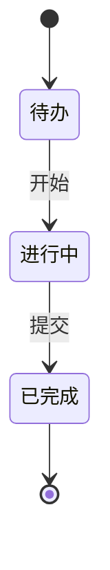
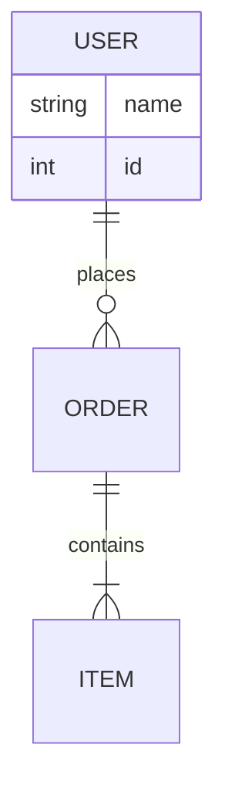
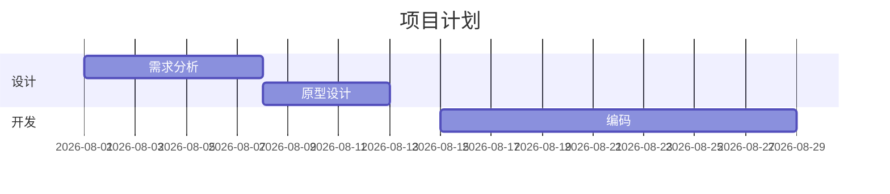
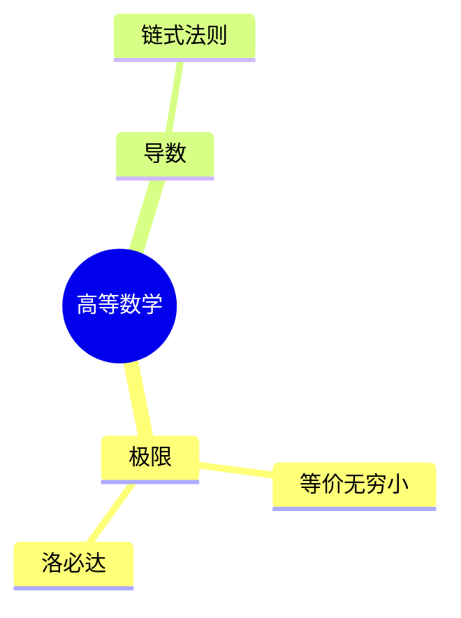

# Mermaid 图表指南（Obsidian 原生支持）

本文档是在 Obsidian 中编写 ` ```mermaid ` 代码块的**权威依据**。Obsidian 内置 Mermaid 渲染引擎，**无需安装任何插件**，阅读视图与实时预览均可直接显示。

## 0. 选型回顾

- **Mermaid**：流程图、时序图、类图、状态图、ER 图、甘特图、饼图、思维导图、时间线、git 图——结构性关系图。
- **TikZ**：数学函数图像、几何、电路、化学式——精确科学与数学图（见 `tikzjax.md`）。
- 拿不准时：能用 Mermaid 表达的就不用 TikZ，声明式语法维护成本低得多。

## 1. 流程图（flowchart）

````

````

- 方向：`TD`（上→下）、`LR`（左→右）、`BT`、`RL`。
- 节点形状：`[矩形]`、`(圆角)`、`{菱形判断}`、`((圆形))`、`[[子程序]]`、`[(数据库)]`。
- 连线：`-->` 实线箭头、`---` 实线、`-.->` 虚线、`==>` 粗线、`-->|文字|` 带标签。
- 旧写法 `graph TD` 仍可用，但新图统一用 `flowchart`。

## 2. 时序图（sequenceDiagram）

````

````

- `->>` 同步消息、`-->>` 返回（虚线）、`->)` 异步。
- 常用块：`loop 描述 ... end`、`alt 条件 ... else ... end`、`opt`、`Note over A,B: 注释`。

## 3. 类图（classDiagram）

````

````

- 关系：`<|--` 继承、`*--` 组合、`o--` 聚合、`-->` 关联、`..>` 依赖。
- 可见性：`+` public、`-` private、`#` protected。

## 4. 状态图（stateDiagram-v2）

````

````

## 5. ER 图（erDiagram）

````

````

- 基数：`||--||` 一对一、`||--o{` 一对多、`}o--o{` 多对多。

## 6. 甘特图（gantt）

````

````

## 7. 其他类型速查

| 类型 | 首行声明 | 适用 |
|------|---------|------|
| 饼图 | `pie title 标题` | 占比分布（`"标签" : 数值`） |
| 思维导图 | `mindmap` | 层级脑图（缩进表达层级，根节点 `root((文字))`） |
| 时间线 | `timeline` | 历史事件、版本演进 |
| git 图 | `gitGraph` | 分支合并示意（`commit`、`branch`、`merge`） |
| 用户旅程 | `journey` | 体验流程评分 |

思维导图示例：

````

````

## 8. 避坑规则（务必遵守）

- **节点文字含特殊字符必须加引号**：`A["包含(括号)的文字"]`。未加引号的 `()`、`[]`、`{}`、`:`、`;` 会导致解析失败——这是 Mermaid 报错的第一大原因。
- **中文可直接使用**，无需转义；但中文与特殊符号混排时同样要加引号。
- 节点 id 用英文/数字，显示文字放方括号内：`A[显示文字]`，不要直接用中文作 id（部分版本兼容性问题）。
- 一行一条语句，不要把多个连线挤在一行。
- **先最小可渲染再扩展**：先写 3-5 个节点确认类型与方向正确，再补全。一次性写 50 行报错时极难定位。
- 甘特图日期格式必须匹配 `dateFormat`；时序图 participant 别名中文字段用 `as` 定义。
- Obsidian 的 Mermaid 版本落后于官网最新版，**避免使用刚发布的新特性**（如 packet、architecture 等新图型），写完若预览空白先怀疑版本兼容性。

## 9. 与闪卡的配合

- Mermaid 图同样**不进闪卡答案**；流程步骤类知识可转为多行闪卡（`?`）或序号挖空。
- 示例：`TCP 三次握手的第二步::服务器回复 SYN+ACK。`
